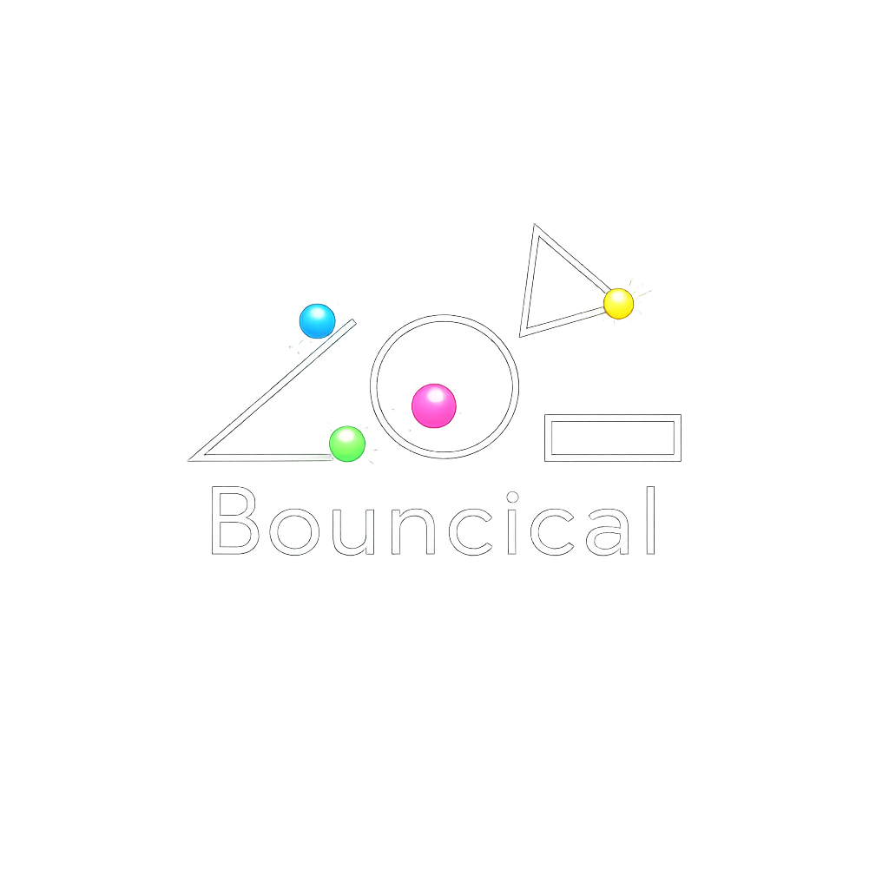

  

<h1 align="center">GravitySinger</h1>

  <strong>A mobile-first, 2D physics sandbox that turns gravity into music.</strong>
   
  Draw shapes, spawn balls, write natural language rules, and let physics compose viral melodies.

---

## 🌟 Overview

**GravitySinger** is an interactive physics-music toy that runs directly in your browser. Inspired by viral physics-music videos, it allows you to build complex Rube Goldberg-style machines and use physics collisions to trigger musical notes. 

The core of the engine combines high-precision 2D physics (`Matter.js`) with generative audio (`Tone.js`) and even allows you to directly upload digital sheet music (`@tonejs/midi`) to perfectly sequence your favorite songs via bouncing balls!

## ✨ Features

- 🎵 **MIDI Physics Integration:** Upload any `.mid` or `.midi` file. Every time a ball bounces, the engine plays the next sequential note of your song. Create chaotic rapid-fire melodies or perfect rhythmic sequences.
- 📐 **Advanced Geometry & Drawing:** Draw perfectly smooth lines, rectangles, triangles, and hollow circles. 
- 🧽 **The "Rubber" Tool:** Use advanced boolean geometry (`polybooljs`) to dynamically cut chunks out of your shapes in real-time. Concave shapes are automatically calculated and decomposed (`poly-decomp`) into convex bodies for perfect collision physics.
- 🧠 **Natural Language Rules Engine:** Create your own game logic by simply typing sentences. 
  - *"when the ball hits a circle it changes color"*
  - *"when the ball falls off screen it respawns but larger"*
  - *"the triangle spins"*
- 📱 **Mobile-First Design:** Featuring a beautiful, dark-mode UI with floating controls and touch-optimized dragging, spawning, and drawing.

## 🚀 How to Run (No Setup Required!)

GravitySinger is a pure static frontend application. There is no build step, no backend server, and no database.

### Option 1: Run Locally
1. Clone or download this repository.
2. Open the folder in your terminal and run a simple local web server (e.g., `npx serve .` or `python -m http.server`).
3. Open `http://localhost:3000` (or the port provided by your server) in your browser.

*Note: A local server is required to bypass browser CORS policies when loading the audio synthesizer.*

### Option 2: Host on GitHub Pages
1. Push this repository to GitHub.
2. Go to your repository **Settings** > **Pages**.
3. Select your `main` branch and click **Save**. 
4. Your physics sandbox is now live on the web!

## 🛠 Tech Stack

GravitySinger is built entirely with Vanilla JavaScript and HTML5 Canvas, leveraging powerful open-source libraries:
- **[Matter.js](https://brm.io/matter-js/):** 2D rigid body physics engine.
- **[Tone.js](https://tonejs.github.io/):** Web Audio framework for generative synthesizers.
- **[@tonejs/midi](https://github.com/Tonejs/Midi):** Parsing uploaded MIDI files into playable notes.
- **[PolyBool.js](https://github.com/voidqk/polybooljs):** Boolean operations on polygons (for the Rubber tool).
- **[Poly-Decomp.js](https://github.com/schteppe/poly-decomp.js/):** Decomposing concave polygons into convex pieces for the physics engine.

## 🎮 Controls

- **Ball:** Click anywhere to spawn a physics ball.
- **Drag:** Grab and move shapes or balls around the board.
- **Shapes (Line, Circle, Tri, Rect):** Click and drag to draw geometry.
- **Erase:** Click any shape to delete it entirely.
- **Rubber:** Click and drag through a shape to dynamically carve chunks out of it.
- **MIDI:** Upload a song to override the dynamic pitch generator with sequential song playback.

---

  <i>Let gravity do the singing.</i>

