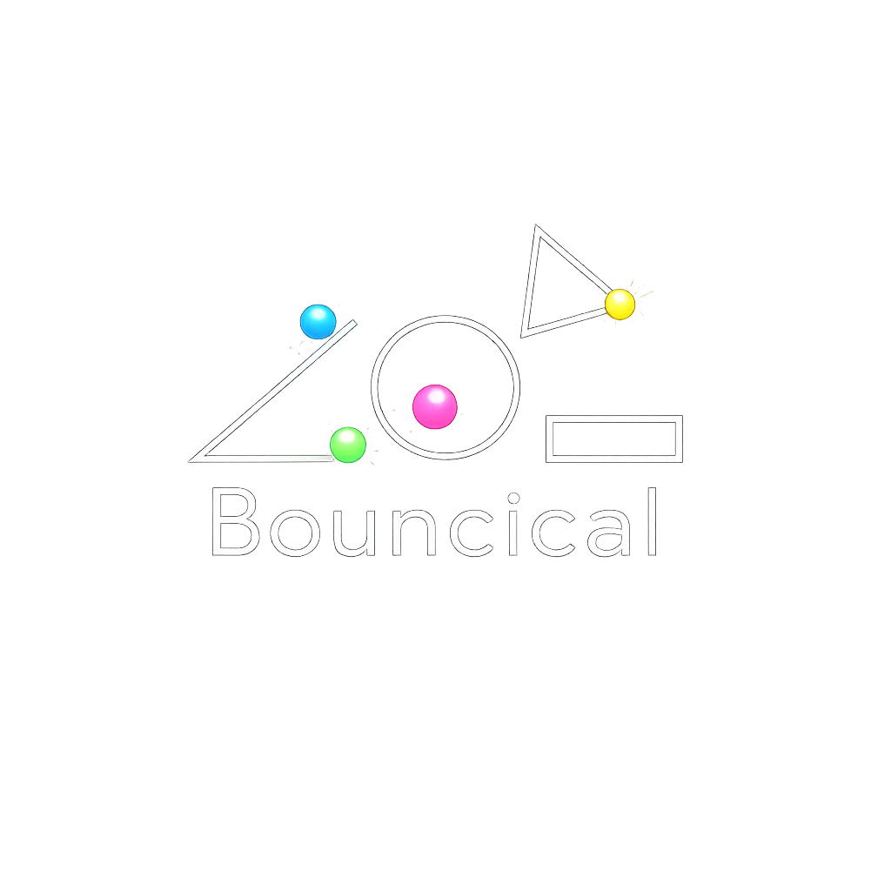

<p align="center">
  
</p>

<h1 align="center">Bouncical</h1>

<p align="center">
  <strong>A 2D physics sandbox that turns gravity into music.</strong>
  <br />
  Draw shapes, drop balls, write rules in plain English or Italian, load a song, and record the result as a video.
</p>

---

## 🚀 Try The App

You can try the app directly in your browser:

<p align="center">
  <a href="https://kekkocoppola.github.io/Bouncical/">
    
  </a>
</p>

## 🌟 Overview

Bouncical is a physics and music toy inspired by viral "bouncing ball" videos. Every collision can play a note, advance a song, fire particles or trigger your own rules. The scene lives in a fixed format (9:16 by default), so it looks the same on a phone, a tablet or a desktop monitor, and you can record it straight to an MP4/WebM video ready for TikTok, Reels or Shorts.

It runs entirely in the browser. There is no build step and no server, and all libraries are bundled in `vendor/`, so the app also works offline.

## ✨ Features

- **Scene formats**: 9:16, 1:1, 16:9 or *Fit* (fills your screen). The scene is scaled to fit any viewport and stays the same when you rotate the phone or resize the window.
- **Drawing tools**: ball (tap to drop, drag to launch), move, line (hold Shift to snap the angle), circle, triangle, rectangle, erase, and rubber (carves pieces out of shapes).
- **Shape inspector**: tap a shape with *Move* to change its color, spin (degrees per second), angle, size, bounciness, circle gap (size and position) or fixed note. You can also duplicate or delete it.
- **Special effects**: impact sparks, confetti, fireworks, stars, shattering shapes, shockwaves, ball trails, neon glow, shapes that light up when hit, screen shake, flashes, a background that pulses with the notes, and the viral *string art* effect. Every effect can be toggled, and there are Low/Medium/High quality presets.
- **Rules** (see below): a *WHEN → IF → THEN* builder with 10 triggers, 4 conditions and 35 actions. You can also type a sentence in English or Italian and it becomes an editable rule card.
- **World settings**: gravity (strength and direction), time speed (slow motion), ball size, bounciness, friction, air resistance, max speed, colors, walls, floor, ceiling, ball-to-ball collisions and a maximum ball count.
- **Songs**:
  - **MIDI** (`.mid`): every bounce plays the next chord. The melody track is picked automatically (drums are skipped), and you can switch track, play chords or the melody only, transpose, and loop.
  - **Audio** (`.mp3`, `.m4a`, `.wav`, `.ogg`, …): every bounce plays the next slice of the real track, so the song advances only while balls bounce. A background mode is also available.
  - With no song loaded, bounces play a scale based on height. There are 9 scales and 6 instruments.
- **Video recording**: the ● button records the scene and its audio at 1080p or higher, then lets you save it or share it on mobile.
- **Viral scenes**: Growing Ball, Ring Escape, Note Rain, String Art, Split Frenzy and Shrinking Arena. They are built from ordinary shapes and rules, so everything stays editable.
- **Undo/redo for everything**: including rubber strokes, inspector edits and *Clear*.

## 🧠 Rules

Open **Rules** and type what should happen, or tap **+ New rule** to build one with menus.

| You type | You get |
|---|---|
| `when the ball hits a circle it grows 10% and the circle spins` | WHEN ball hits circle → ball grows 10%, circle spins clockwise |
| `every 2 seconds spawn a ball at the top` | WHEN every 2 s → 1 new ball at the top |
| `when a ball escapes the ring, the ring breaks and spawn 2 new balls in the center` | WHEN ball escapes circle → circle breaks, 2 balls at the center |
| `quando la pallina tocca il cerchio diventa più grande del 10% e il cerchio gira` | same as the first row, in Italian |
| `ogni 3 colpi la pallina esplode in 4` | WHEN ball hits a shape (every 3rd hit) → ball explodes into 4 |
| `con probabilità del 25% quando la pallina tocca un rettangolo si duplica` | WHEN ball hits rectangle (25% chance) → ball clones itself |

- **WHEN** (triggers): ball hits a shape, a wall/floor/ceiling or another ball · ball escapes a circle · ball leaves the screen · ball appears · every N seconds · simulation starts · ball count reaches N · no balls left.
- **IF** (conditions): every N-th time (per ball or in total) · % chance · at most N times · cooldown.
- **THEN** (actions):
  - **Ball**: color, grow, shrink, speed up, slow down, bounciness, reverse, launch, stop, clone, explode, disappear, respawn, teleport, pitch, trail, string art.
  - **Shape**: spin, grow, shrink, color, break apart, circle gap.
  - **World**: gravity, slow motion, spawn balls, remove all balls, pause, open or close the floor and walls.
  - **Effects**: particle burst, shake, flash, shockwave, floating text.
  - **Sound**: play a note.

Rules and settings are saved in your browser.

## 🎮 Controls

| Action | Touch / mouse | Keyboard |
|---|---|---|
| Play / pause | ▶ button | `Space` |
| Tools | toolbar | `1`–`8` |
| Undo / redo | ↶ ↷ | `Ctrl/⌘+Z` · `Ctrl/⌘+Shift+Z` or `Ctrl+Y` |
| Delete selected shape | inspector → Delete | `Delete` / `Backspace` |
| Close panel / menu | ✕ | `Esc` |
| Load a song | Music → Load song, or drop a file on the page | |

## 🛠 Run Locally

It is a static site, so any web server works (ES modules don't load from `file://`):

```bash
npx http-server -c-1 .      # or: npm start
# or
python3 -m http.server
```

Then open the printed URL. To publish it, enable **GitHub Pages** on the repository (Settings → Pages → deploy from branch).

Run the tests (Node 20+):

```bash
npm test
```

## 📁 Project Structure

```
index.html, style.css       layout (portrait dock / landscape rails) and styles
js/main.js                  boot + frame loop
js/game.js                  simulation: collisions → sound → effects → rules
js/stage.js                 scene formats, scaling, coordinates
js/physics.js               Matter.js engine, fixed 120 Hz step, borders
js/shapes.js, balls.js      shape model (rubber cuts, ring gaps), balls
js/scene.js                 registry + undo/redo
js/tools.js                 pointer tools
js/render.js, fx.js         drawing and special effects
js/audio.js, song.js        instruments, scales, MIDI and audio songs
js/recorder.js              video recording
js/templates.js             viral scenes
js/rules/                   catalog, engine, EN/IT parser, actions, builder UI
js/ui/                      panels, forms, controls
vendor/                     pinned third-party libraries (see vendor/LICENSES.md)
tests/                      parser unit tests
```

## 🧩 Tech Stack

Vanilla JavaScript (ES modules) and HTML5 Canvas, with:
- **[Matter.js](https://brm.io/matter-js/)**: 2D rigid body physics.
- **[Tone.js](https://tonejs.github.io/)**: Web Audio synthesis.
- **[@tonejs/midi](https://github.com/Tonejs/Midi)**: MIDI parsing.
- **[PolyBool.js](https://github.com/velipso/polybooljs)**: polygon boolean operations for the rubber tool.
- **[poly-decomp.js](https://github.com/schteppe/poly-decomp.js/)**: convex decomposition for physics bodies.

---

<p align="center">
  <i>Let gravity do the singing.</i>
</p>
